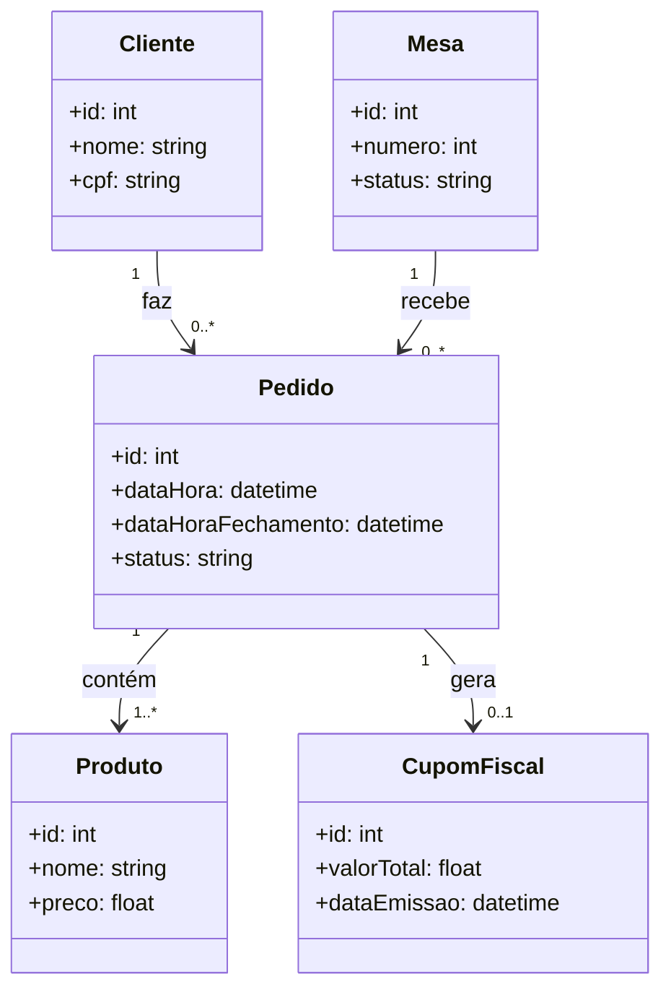
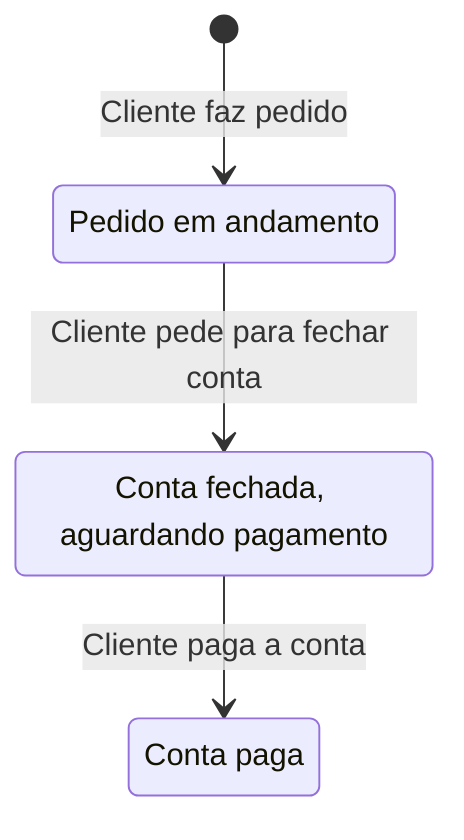
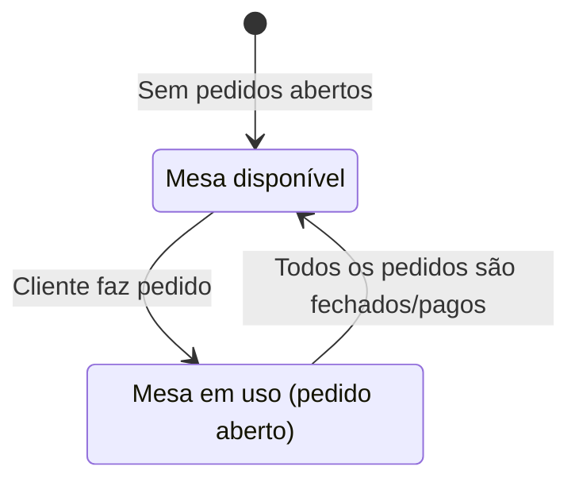

# API de restaurante.

Este projeto é uma API genérica de sistema de restaurante. Contempla a marcação, impressão pagamento, emissão do cupom fiscal e fechamento.

Ao cadastrar um cliente e uma mesa, você consegue cadastrar um pedido. O pedido só é marcado com sucesso se a mesa estiver fechada, ou seja, sem nenhum pedido em aberto. Voce pode ir adicionando item informando o id do produto e o id do pedido, desde que o pedido esteja em aberto. Pedidos fechados ou pagos não são permitidos adicionar itens. A rota de adicionar produtos não remove produtos, pois em um restaurante, a remoção de um produto é chamada de estorno, e o estorno só é feito com a autorização do gerente, e informando o motivo do estorno. Essa funcionalidade não foi implementada.

Um pedido ao ser fechado, ele pode ser pago. Não é possível pagar um pedido com estado aberto ou pago. Ao ser pago, automaticamente gera um cupom fiscal.

Toda essa implementação eu fiz baseado no tempo que trabalhei em operação de restaurante.

## Mapa de entidades

## Diagrama de estado do Pedido

## Diagrama de estado da mesa

## Links

[Documentação swagger](https://dioprojetoapijava-production.up.railway.app/swagger-ui/index.html)

## Deployment

Há dois perfis spring. Dev para desenvolvimento e prd para produção. Para o perfil de produção, deve informar as váriaveis de ambiente do Banco de dados Postgresql. Esse projeto fui hospedado no Railway.